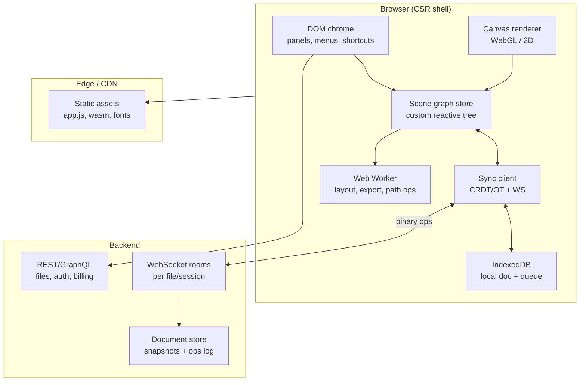
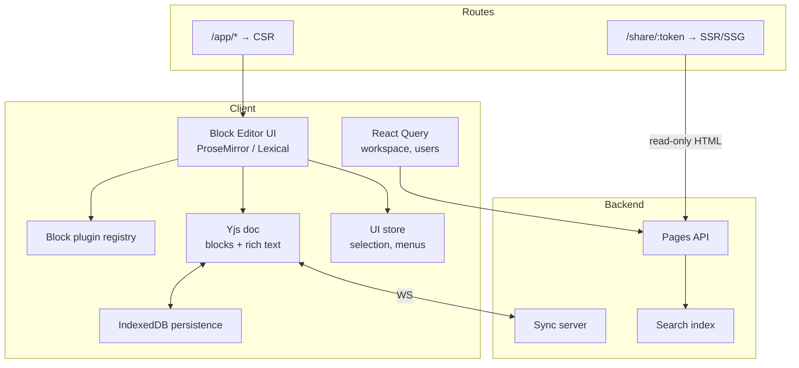
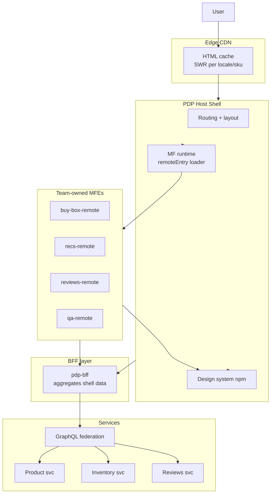
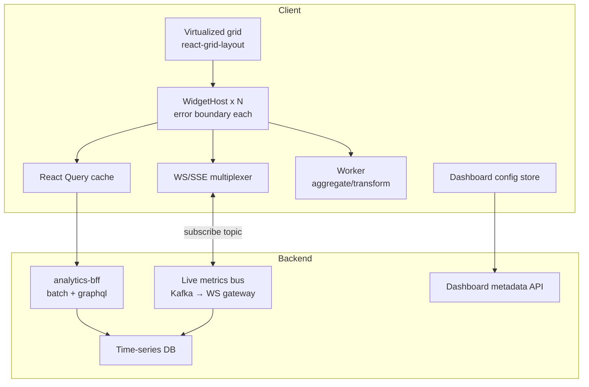
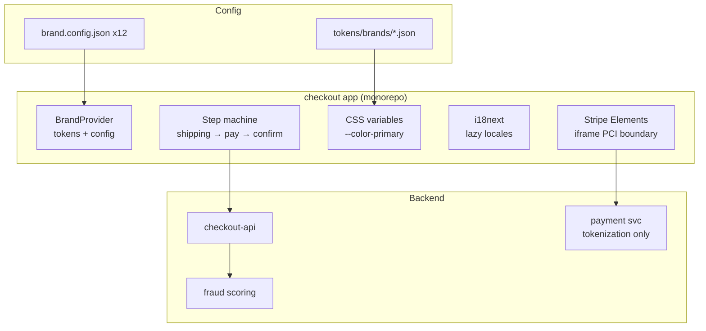
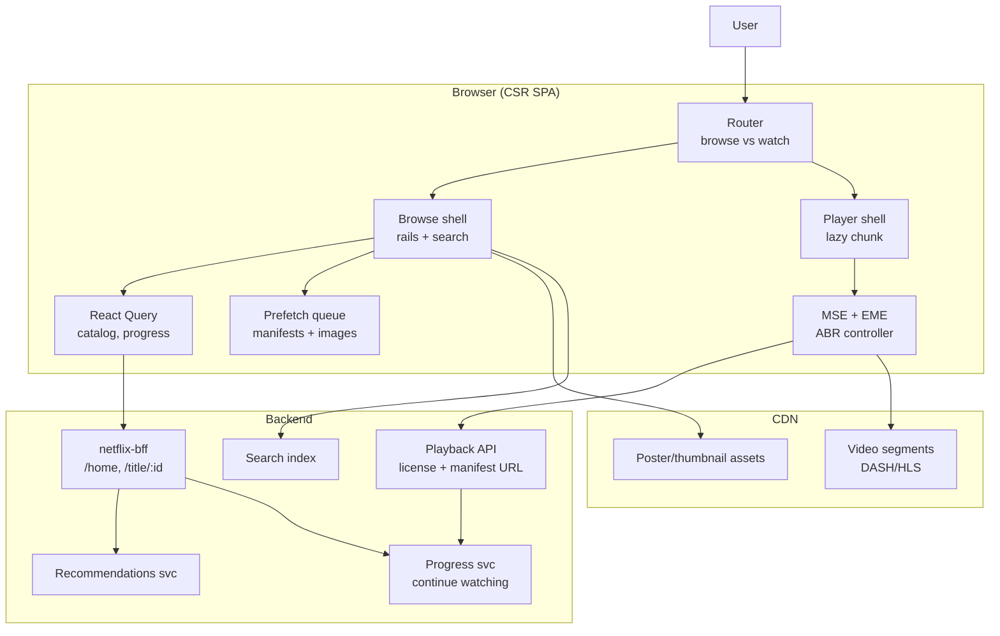

# 11 – Mock Prompts (Run At Least One Tonight)

> **Abbreviations:** [Glossary (00)](./00-glossary.md) — DAU (Daily Active Users), SLA (Service Level Agreement), MFE (Micro-Frontend), MF (Module Federation), BFF (Backend for Frontend), CRDT (Conflict-free Replicated Data Type), OT (Operational Transformation), SSE (Server-Sent Events), PCI (Payment Card Industry), i18n (Internationalization), WebGL (Web Graphics Library), A/B (A/B testing), RUM (Real User Monitoring), LCP (Largest Contentful Paint), INP (Interaction to Next Paint), TTI (Time to Interactive).

Pick **one** prompt. Time yourself: **45 min design + 15 min Q&A**. Whiteboard or paper. Record yourself. Listen back at 1.5x while making dinner.

**How to use the expanded sections below:** Read the **60-second talk-track** first, then drill into **Clarifying questions** and **Full walkthrough**. Use **Follow-up Q&A** to simulate the last 15 minutes. Score yourself with the rubric at the bottom.

---

## Universal Design Template (use for every prompt)

Walk in this order – interviewers know the structure and will follow you:

1. **Clarify** (3 min) – ask 5 questions to define scope. Write them down.
   - Audience, scale (DAU, regions), key metrics, must-have vs nice-to-have, constraints (auth, offline, SEO).
2. **High-level diagram** (5 min) – client / edge / origin / data, with deploy units.
3. **Rendering strategy** (5 min) – per-route CSR/SSR/SSG, justify.
4. **Component architecture** (5 min) – key components, headless vs opinionated, state ownership.
5. **State + data** (8 min) – server vs client state, cache layers, mutation patterns, optimistic updates.
6. **Cross-cutting** (10 min) – auth, i18n, theming, accessibility, error handling.
7. **Architecture decisions** (5 min) – monorepo vs multi, monolith vs MFE, deploy units.
8. **Perf budget** (3 min) – Web Vitals targets, code splitting, bundle limits.
9. **Observability** (3 min) – errors, RUM, traces, alerts.
10. **CI/CD + rollout** (3 min) – preview envs, canary, feature flags, rollback.

If you cover steps 1–7 well, you've passed. 8–10 is what gets you to "strong hire."

---

## Prompt 1: Design Figma's multiplayer canvas frontend

### 60-second talk-track

> "Figma is a **CSR-only, canvas-first app** – no SEO, heavy WebGL/2D rendering, real-time collaboration. I'd model the document as a **scene graph** with reactive subscriptions per node, sync via **CRDT or OT** over WebSocket, and keep the DOM for chrome only (panels, menus). Performance is about **frame budget** (60fps), throttled cursor broadcasts, and web workers for layout/export. Offline is IndexedDB + a mutation queue that replays on reconnect. Plugins are a **sandboxed extension system** – think MFE-lite with strict API boundaries."

### Clarifying questions (ask these first)

| Question | Why it matters |
|---|---|
| How many concurrent editors per file? 2? 50? 500? | Drives sync fan-out, cursor throttle rate, server architecture |
| Must we support offline editing or view-only offline? | Full offline → CRDT + IndexedDB; view-only is much simpler |
| Plugin ecosystem in scope or just core editor? | Plugins add sandboxing, versioning, and crash isolation |
| Target devices – desktop only or iPad too? | Touch + stylus changes hit-testing, gesture handling, perf budget |
| What's the SLA for sync latency? <100ms perceived? | Sets WebSocket topology (regional rooms vs single hub) |
| Are we greenfield or migrating from an existing editor? | Migration constrains data model and sync protocol choices |

### Full walkthrough

#### 1. Clarify scope (example answers)

- **Audience:** Designers and PMs, desktop-first, iPad secondary.
- **Scale:** ~3M DAU, typical file has 2–8 concurrent editors, power users hit 10k+ nodes.
- **Success metrics:** Frame time p95 < 16ms, sync round-trip p95 < 150ms, zero data loss on reconnect.
- **Must-have:** Multiplayer cursors, undo/redo, layers panel, export PNG/SVG.
- **Nice-to-have:** Offline mode, plugin marketplace, version history UI.

#### 2. High-level diagram



#### 3. Rendering strategy

| Surface | Strategy | Why |
|---|---|---|
| `/file/:id` (editor) | **CSR** | Canvas/WebGL, no SEO, huge JS, needs GPU |
| `/`, `/pricing`, marketing | **SSG/SSR** | SEO, fast LCP – separate marketing site or route group |
| `/proto/:id` (view-only link) | **CSR** or lightweight viewer | May ship smaller read-only bundle |

**Key point:** The canvas is **not the React tree**. React owns chrome; the renderer reads from the scene graph and paints frames independently. Mixing every shape as a DOM node won't scale past a few hundred elements.

#### 4. Component architecture

```
AppShell
├── FileProvider (file id, permissions, sync status)
├── EditorLayout
│   ├── Toolbar          (React – command dispatch)
│   ├── LayersPanel      (React – virtualized tree, subscribes to SG)
│   ├── PropertiesPanel  (React – selection-driven)
│   ├── CanvasViewport   (imperative – mounts canvas, pointer → hit test)
│   └── MultiplayerCursors (canvas overlay layer)
└── PluginHost (iframe/worker sandbox – optional)
```

- **Scene graph:** Custom store – nodes `{ id, type, transform, style, children }`, not Redux. Use **structural sharing** (immutable updates) so React panels can subscribe to subtrees.
- **Commands:** Undo/redo as a **command stack** on top of CRDT ops, or CRDT-native undo (harder).
- **Headless pattern:** `useSelection()`, `useLayer(id)`, `useViewport()` hooks read from SG; UI components stay dumb.

#### 5. State + data

| Bucket | Where | Examples |
|---|---|---|
| Document state | Scene graph + CRDT | layers, paths, text, transforms |
| Ephemeral collab | Sync layer | cursors, selections, "user X is editing" |
| UI state | React local / Zustand | panel open, zoom level, active tool |
| Server state | React Query | file metadata, team list, billing |

**Sync protocol:** Start with **CRDT** (Yjs-style) if offline + branching matter; **OT** if you control a central server and want simpler conflict semantics. Broadcast **deltas**, not full doc. Compress with binary encoding (MessagePack/protobuf).

**Local-first writes:** Apply op locally → render immediately → send to server → reconcile if server rejects (rare with CRDT).

#### 6. Cross-cutting

- **Auth:** JWT/session for API; WebSocket auth via short-lived token on connect. File-level ACL (view/edit/admin).
- **Accessibility:** Canvas is hard – provide **parallel DOM representation** or ARIA live regions for selection changes; keyboard shortcuts for all tools.
- **Error handling:** Sync disconnect → banner + continue local edits + queue; canvas OOM → simplify rendering (disable effects).
- **i18n:** Chrome only; document content is user language.

#### 7. Architecture decisions

- **Monorepo:** `apps/editor`, `packages/scene-graph`, `packages/sync-client`, `packages/canvas-renderer`.
- **Not MFE** for core editor – one team, one runtime, tight coupling. **Plugins** are the extension boundary (iframe/worker + postMessage API).
- **Deploy:** Single editor app to CDN; WebSocket service separate (Node/Go/Rust), horizontally scaled by room.

#### 8. Perf budget

- **60fps** → 16.6ms frame budget; profile with `requestAnimationFrame` marks.
- Throttle cursor updates to **20–30 Hz**; interpolate between positions.
- **Viewport culling:** Don't paint off-screen nodes; use spatial index (R-tree).
- **Level of detail:** Simplify strokes when zoomed out.
- Main bundle < **500kb gzip** for editor shell; lazy-load export formats.

#### 9. Observability

- RUM: FPS (custom metric), long tasks, WebSocket reconnect rate.
- Traces: `applyOp → render → framePresent` spans.
- Alerts: sync lag p99 > 500ms, error rate on WS connect, crash rate per release.

#### 10. CI/CD + rollout

- Feature flags for new tools (decouple deploy from release).
- Canary 5% of users on new renderer path.
- Rollback: CDN pointer flip; WS protocol must be **backward compatible** for at least one version.

### Trade-offs to name out loud

| Choice | Pros | Cons |
|---|---|---|
| CRDT vs OT | Offline, peer-to-peer potential | Larger payloads, harder mental model |
| Canvas vs DOM nodes | Scales to 10k+ shapes | A11y pain, no CSS layout |
| Central WS room vs P2P | Simpler auth, persistence | Server fan-out cost at scale |
| Plugin iframe vs worker | Strong isolation | Higher memory, slower IPC |

### Follow-up Q&A

**Q: How do you handle two users editing the same text node?**
<details>
<summary>Strong answer</summary>

CRDT gives **automatic merge** on concurrent inserts (Yjs Text type). OT needs a server to **transform** ops against concurrent edits. UX: show remote selection highlights, optional "follow user" mode. Never block local typing waiting for server – apply optimistically.

</details>

**Q: Undo/redo with multiplayer?**
<details>
<summary>Strong answer</summary>

**Per-user undo stack** that only reverses your ops (Figma model), not global undo – global undo breaks other users' expectations. Implement by tagging each op with `clientId` + undo metadata, or maintain a local undo stack of op inverses.

</details>

**Q: How do plugins not steal the whole app?**
<details>
<summary>Strong answer</summary>

Run in **iframe or worker** with a narrow `postMessage` API: read selection, create nodes, subscribe to events. No direct DOM/canvas access. Version plugins against API semver; host rejects unknown API calls. Crash in plugin → kill sandbox, editor keeps running.

</details>

**Q: What breaks at 50 concurrent users on one file?**
<details>
<summary>Strong answer</summary>

Cursor/selection broadcast storm, WS room CPU, CRDT merge cost. Mitigate: **throttle + aggregate** presence updates, regional edge rooms, cap "live cursors" display to nearest N users, move heavy ops (export) to workers.

</details>

### Common mistakes (don't say these)

- "I'd render each layer as a React component" – doesn't scale.
- "Redux for the whole document" – wrong tool; need granular subscriptions.
- "SSR the editor for SEO" – wrong product surface.
- "WebRTC for everything" – ops still need authoritative persistence.

---

## Prompt 2: Design Notion-style block editor (offline-first + collaborative)

### 60-second talk-track

> "Notion is a **block tree** at its core – typed blocks (paragraph, heading, todo, embed) with rich text inside. The editor is **CSR** for the app; **SSR/SSG** for public share pages (SEO). Sync is **CRDT-first** (Yjs/Automerge) with **IndexedDB persistence** so edits survive refresh. Separate **document state** (CRDT) from **UI state** (selection, slash menu). Blocks are a **plugin registry** – compound `Editor.Block.*` API. Long pages get **virtualized**; embeds lazy-load. Auth is **page-level permissions** with capability tokens on share links."

### Clarifying questions

| Question | Why it matters |
|---|---|
| Real-time collab required or async sync (Google Docs vs Obsidian sync)? | Real-time → WebSocket + CRDT; async → simpler last-write-wins or git-sync |
| Public pages need SEO/indexing? | Drives SSR/SSG for `/share/*` routes |
| Block types fixed or user/installable plugins? | Plugin registry + sandboxing scope |
| Mobile web in scope? | Touch editing, virtual keyboard, perf on long pages |
| Max document size? | Virtualization threshold, CRDT compaction strategy |
| Compliance (SOC2, data residency)? | Where IndexedDB/cloud sync lives |

### Full walkthrough

#### 1. Clarify scope

- **Audience:** Knowledge workers, teams 5–500, mobile read-heavy / desktop edit-heavy.
- **Scale:** 10M docs, avg 200 blocks/doc, 1–5 concurrent editors typical.
- **Metrics:** Time to first keystroke < 100ms, sync p95 < 200ms, autosave success 99.9%.
- **Must-have:** Block CRUD, slash commands, offline edit, share link, permissions.
- **Nice-to-have:** Real-time cursors, comments, databases (Notion tables).

#### 2. High-level diagram



#### 3. Rendering strategy

| Route | Strategy | Why |
|---|---|---|
| `/app/**` (editor) | **CSR** | Contenteditable, CRDT, heavy JS |
| `/share/:id` public | **SSR/SSG + ISR** | SEO, Open Graph, fast first paint |
| `/share/:id` private | **CSR** after auth gate | No leaking content to CDN |

Public share pages: server renders **static HTML snapshot** from last published version; no editor bundle unless user clicks "Edit" or "Duplicate."

#### 4. Component architecture

```tsx
// Compound block API
Editor.Root
Editor.Toolbar
Editor.BlockList          // virtualized
Editor.Block.Paragraph    // registers type: 'paragraph'
Editor.Block.Heading
Editor.Block.Todo
Editor.SlashMenu          // command palette
Editor.InlineMenu         // bold, link, ...
```

- **Block plugin contract:**
  ```ts
  type BlockPlugin = {
    type: string;
    schema: ProseMirrorNodeSpec; // or Lexical node
    render: (props: BlockRenderProps) => ReactNode;
    serialize: (node) => JSON;
    deserialize: (json) => node;
  };
  ```
- **Headless:** `useBlockEditor()`, `useBlock(id)`, `useSlashCommands()` – UI swappable.

#### 5. State + data

| State | Store | Notes |
|---|---|---|
| Document (blocks + text) | **Yjs CRDT** | Source of truth offline and online |
| Selection, focus, menus | Zustand / local | Never put in CRDT |
| Workspace, members | React Query | Server state |
| URL (page id, block anchor) | Router | `#block-uuid` for deep links |

**Autosave:** Yjs `update` event → debounce 500ms → IndexedDB + WebSocket send. On reconnect, **sync step 1/2** (Yjs) or state vector merge.

**Conflict resolution:** CRDT merges automatically; show rare "diverged history" admin tool for support.

#### 6. Cross-cutting

- **Auth:** Workspace RBAC; page roles (view/comment/edit). Share links = **capability URL** (`token` maps to read-only scope, expiring).
- **i18n:** UI strings ICU; block content user-defined.
- **a11y:** contenteditable is painful – roving tabindex, aria on blocks, keyboard nav between blocks (Notion-style).
- **Embeds:** Lazy iframe on viewport; facade placeholder until loaded.

#### 7. Architecture decisions

- **Monorepo modular monolith** – not MFE unless databases/comments are separate teams at scale.
- Packages: `@org/crdt-doc`, `@org/block-plugins`, `@org/editor-ui`, `apps/web`.
- **ProseMirror vs Lexical:** ProseMirror = battle-tested schema; Lexical = React-native, Meta-backed. Either works; mention schema versioning.

#### 8. Perf budget

- Virtualize block list after ~**100 blocks** (react-window / `@tanstack/virtual`).
- Slash menu search: debounce 150ms, server fuzzy index for workspace mentions.
- Editor chunk **< 300kb gzip** initial; block plugins code-split.
- INP target **< 200ms** on keystroke (avoid sync work on main thread – offload Yjs encode to worker if needed).

#### 9. Observability

- Metrics: autosave failure rate, sync latency, CRDT update size p95, block render time.
- Logs: structured `pageId`, `workspaceId` (no body content – PII).
- Alerts: IndexedDB quota exceeded, WS auth failures spike.

#### 10. CI/CD + rollout

- **Schema migration** for block JSON – version field per block, upcasters in client.
- Feature flag new block types; old clients show "update app" fallback card.
- Public page ISR: revalidate on publish webhook.

### Trade-offs

| Choice | When | Risk |
|---|---|---|
| CRDT (Yjs) | Offline + real-time | Bundle size ~80kb, learning curve |
| OT + central server | Simpler conflicts | Offline is hard |
| Full page SSR for editor | Never for logged-in edit | Hydration mismatch hell |
| Block = React component | Simple mental model | 1000 blocks = 1000 roots – virtualize |

### Follow-up Q&A

**Q: How is a block stored on the wire?**
<details>
<summary>Strong answer</summary>

Each block: `{ id: uuid, type: 'todo', props: { checked: false }, content: ytext }`. Tree structure via `parentId` + ordering (Y.Array of ids or nested Y.Map). Rich text as **Y.Text** for CRDT merges. Snapshot + incremental updates for load performance.

</details>

**Q: User goes offline for 3 days, then reconnects – what happens?**
<details>
<summary>Strong answer</summary>

Local Yjs doc in IndexedDB has full state + pending updates. On reconnect, client sends **state vector**; server responds with missing ops; merge is CRDT-deterministic. If server compacted history, client may need snapshot fetch. UI: subtle "Synced" indicator, never block editing.

</details>

**Q: Slash command architecture?**
<details>
<summary>Strong answer</summary>

`/` triggers local fuzzy search over **command registry** (insert block, turn into heading). Commands are pure functions `(editor, args) => transaction`. Server-backed commands (mention person) debounce fetch, show in popover. Keyboard nav ↑↓ Enter – all headless in `useSlashMenu()`.

</details>

**Q: Why separate UI state from CRDT doc?**
<details>
<summary>Strong answer</summary>

Selection/cursor in CRDT **bloats sync** and merges badly (every mousemove). Ephemeral awareness goes over **awareness protocol** (Yjs awareness or separate channel). Document ops are durable; UI ops are discardable.

</details>

### Common mistakes

- Putting selection in Redux/CRDT.
- SSR the logged-in editor (hydration + contenteditable = pain).
- One React component per block without virtualization.
- Share link that leaks content through CDN cache keys.

---

## Prompt 3: Design Amazon's product detail page at scale (50+ teams)

### 60-second talk-track

> "A PDP is **SEO-critical** – SSR with **edge caching** and `stale-while-revalidate`. At Amazon scale, **50+ teams** own slices (reviews, recs, buy box, Q&A) → **Module Federation** or server-side composition (ESI) with a **thin host shell**. Shared **design system via npm**, React singleton via MF `shared`. Data through **BFF per surface** to kill waterfalls; **GraphQL federation** behind it. **A/B tests** assigned server-side. Each MFE has **error boundary, bundle budget, RUM tag**. Independent deploys with **contract tests** – accept staggered rollout, not atomic."

### Clarifying questions

| Question | Why it matters |
|---|---|
| Which teams deploy independently vs weekly train? | MF only where org pain is real |
| Global locales / currencies? | Edge variants, hreflang, price formatting |
| Personalization level (signed-in vs anonymous)? | Cache key strategy at CDN |
| SEO bot vs human traffic split? | `onAllReady` vs `onShellReady`, bot detection |
| SLA for recs/reviews freshness? | TTL vs edge stale-while-revalidate |
| Regulatory (price display laws in EU)? | Server-rendered price, no client-only |

### Full walkthrough

#### 1. Clarify scope

- **Audience:** Global shoppers, mobile-heavy, bots for SEO.
- **Scale:** 100M+ PDP views/day, 50 teams, 200+ SKUs/minute updates.
- **Metrics:** LCP < 2.5s p75, CLS < 0.1, conversion rate, MFE error budget.
- **Must-have:** Title, price, images, buy box, reviews summary, SEO schema.org.
- **Nice-to-have:** Live inventory, personalized recs, 360° view.

#### 2. High-level diagram



#### 3. Rendering strategy

| Segment | Strategy | Why |
|---|---|---|
| PDP HTML shell + above-fold | **SSR + edge cache** | SEO, LCP (title, hero image, price) |
| Below-fold MFEs (Q&A, similar items) | **SSR placeholder + lazy hydrate** or **client lazy load** | TTI, bundle split |
| Personalized modules (signed-in) | **CSR island** or **edge variant** | Cache fragmentation – often `'private', no-store'` at edge |

**Cache-Control example:** `public, s-maxage=60, stale-while-revalidate=600` for anonymous PDP; shorter TTL for price/inventory strip.

**Streaming SSR:** Shell + buy box first; stream reviews when slow service returns (`<Suspense>` + `renderToPipeableStream`).

#### 4. Component architecture

```
PdpPage (host)
├── PdpMeta (SSR – title, json-ld, og:image)
├── PdpGallery (host or MF – LCP critical)
├── BuyBoxRemote (MF – cart team)
├── ProductDetails (host – static specs table)
├── ReviewsRemote (MF – lazy)
├── RecommendationsRemote (MF – lazy + IntersectionObserver)
└── MfeErrorBoundary (per remote)
```

**Host owns:** routing, auth cookie, analytics context, layout grid slots, fallback skeletons.

**Remote owns:** internal UI, data fetching (or props from BFF), team metrics.

#### 5. State + data

- **Server state:** Product, price, inventory → SSR props + React Query hydrate on client for mutations (add to cart).
- **Cart:** Global client store (Zustand) or host-provided context – **shared MF module** `@org/cart-client`.
- **A/B variants:** Assigned in BFF, passed as `experimentAssignments` prop – consistent server/client.
- **No GraphQL from browser to 12 services** – BFF aggregates:

```ts
// pdp-bff response (one round trip)
{
  product: { asin, title, images, price },
  buyBox: { seller, delivery, cta },
  reviewsSummary: { rating, count },
  experiments: { 'recs-algo': 'B' }
}
```

#### 6. Cross-cutting

- **i18n:** Locale in URL (`/de/dp/...`); MF receives `locale` prop; RTL at design system level.
- **Auth:** Session cookie; signed-in PDP may bypass shared cache – **edge includes cookie variant** or edge worker for personalization slot only.
- **Accessibility:** Host ensures heading order; MFEs must not break h1–h6 sequence (lint in contract tests).
- **Error handling:** `MfeErrorBoundary` → skeleton or "Reviews unavailable" – never white screen.

#### 7. Architecture decisions

- **MF when:** 4+ teams, independent deploy cadence, clear slot boundaries.
- **npm when:** design system, utils, analytics wrapper, auth client types.
- **Alternative at edge:** **ESI/SSI fragments** – server composes HTML, no client MF runtime (better SEO/perf, worse interactivity).
- **Contract testing:** Pact or snapshot of `remoteEntry` exports + prop interfaces; host CI fails if remote breaks API.

#### 8. Perf budget

| Metric | Target |
|---|---|
| LCP | < 2.5s – preload hero `fetchpriority="high"` |
| JS per MFE | < 50kb gzip each, enforced in CI |
| Total JS | < 200kb initial for above-fold |
| CLS | Reserve space for MF slots – skeleton with fixed height |

**Below-fold:** `React.lazy(() => import('recs/Carousel'))` + `client:visible`.

#### 9. Observability

- RUM tag: `mfe=buy-box`, `mfe=reviews` – separate error rates.
- Trace: BFF span → downstream GQL services; propagate `traceparent`.
- Dashboards: per-MFE LCP contribution, remote load failure rate.
- Alerts: buy-box remote fetch failure > 0.1% for 5 min → page on-call (revenue impact).

#### 10. CI/CD + rollout

- Each MFE: own pipeline → deploy to CDN path `/mfe/reviews/v1.2.3/remoteEntry.js`.
- Host pins **semver range** or explicit version in config; gradual remote rollout.
- **No atomic deploy** – host v5 + reviews v3 + buybox v7 concurrently; contract tests mitigate.
- Rollback: repoint remote URL or feature flag slot to previous version.

### Trade-offs

| Approach | Pros | Cons |
|---|---|---|
| Module Federation | Independent deploy, shared React | Runtime fetch fail, version skew |
| npm packages only | Type-safe, build-time | Rebuild host for every team ship |
| Edge ESI fragments | Fast TTFB, no MF JS | Less client interactivity |
| Single monolith | Simple | 50 teams can't ship |

### Follow-up Q&A

**Q: How do you prevent two copies of React?**
<details>
<summary>Strong answer</summary>

MF `shared: { react: { singleton: true, requiredVersion: '^18.2.0' } }`. Host and remotes align via **shared dependency policy** in CI (lint `package.json` peers). Mismatch → runtime warning or duplicate hooks crash – catch in integration tests.

</details>

**Q: CDN caches stale price – how do you fix?**
<details>
<summary>Strong answer</summary>

Short **s-maxage** for price strip, or **edge-side include** for dynamic fragment. Tag-based purge on price update webhook. Client-side price verify on add-to-cart (server authoritative). Never rely on client-only price for display in EU/compliance contexts.

</details>

**Q: A/B test without flicker?**
<details>
<summary>Strong answer</summary>

Assign variant **on server** (cookie or hash of user id), render correct branch in SSR HTML. No client `if (experiment)` flip after hydration. Track assignment in analytics from server response.

</details>

**Q: Reviews team ships broken remote – what happens?**
<details>
<summary>Strong answer</summary>

`MfeErrorBoundary` catches, shows fallback, RUM fires `mfe_load_error`. Host unaffected – buy box still works. Rollback reviews remote independently. Contract tests should have caught missing export – postmortem on test gap.

</details>

### Common mistakes

- MF for 2 teams (over-engineering).
- Client-side-only product JSON – SEO disaster.
- One global error boundary – one team takes down page.
- Same cache key for all locales.

---

## Prompt 4: Design a real-time analytics dashboard with 200+ widgets per page

### 60-second talk-track

> "This is an **authenticated CSR app** – no SEO. The hard problem is **200 widgets** on one page → **virtualized grid** so only ~20 DOM nodes exist. Each widget owns a **React Query** key; BFF **batches** identical requests. Live data via **WebSocket or SSE** – widgets subscribe to topics. Chart libs **lazy-loaded** per widget type. **Error boundary per widget** – one bad query doesn't kill the dashboard. Config in **URL + server persist**; workers for heavy aggregation."

### Clarifying questions

| Question | Why it matters |
|---|---|
| Refresh rate per widget – 1s? 60s? event-driven? | WS vs polling, backpressure |
| Can users edit layout (drag-drop)? | Persisted config schema, optimistic saves |
| Same data source across many widgets? | Query coalescing / batch endpoint |
| Mobile or desktop-only? | Grid vs list, touch drag |
| Multi-tenant isolation? | Auth on every WS topic subscription |
| Historical drill-down in widget? | Larger payloads, lazy fetch |

### Full walkthrough

#### 1. Clarify scope

- **Audience:** Ops/analytics teams, desktop primary.
- **Scale:** 500 tenants, dashboards with 50–250 widgets, 10 concurrent viewers.
- **Metrics:** Dashboard TTI < 3s, widget data p95 < 500ms, WS reconnect < 2s.
- **Must-have:** Drag layout, 10 chart types, live metrics, export CSV.
- **Nice-to-have:** Annotations, shared dashboards, TV mode.

#### 2. High-level diagram



#### 3. Rendering strategy

| Route | Strategy | Why |
|---|---|---|
| `/dashboard/:id` | **CSR** | Auth, WebSocket, heavy charts |
| `/login`, marketing | **SSG** | Irrelevant to core design |
| Embedded widget iframe | **CSR minimal** | Third-party embed – separate tiny bundle |

Entire dashboard is one SPA route – no SSR needed (data is private, charts need `window`).

#### 4. Component architecture

```
DashboardPage
├── DashboardProvider (id, permissions, global time range)
├── DashboardToolbar (time range, refresh, share)
├── VirtualizedGrid
│   └── WidgetSlot (x visible only)
│       ├── WidgetChrome (title, menu, drag handle)
│       ├── WidgetErrorBoundary
│       └── WidgetRenderer (type → lazy component)
└── WidgetCatalog (add widget modal)
```

**Widget registry:**
```ts
const widgets = {
  lineChart: () => import('./widgets/LineChart'),
  kpi: () => import('./widgets/Kpi'),
  table: () => import('./widgets/Table'),
};
```

#### 5. State + data

| State | Location | Notes |
|---|---|---|
| Widget data series | React Query `['widget', id, timeRange]` | Stale time 30s, refetch on focus optional |
| Live ticks | WS → patch query cache | `queryClient.setQueryData` incremental |
| Layout config | URL hash optional + server JSON | `{ widgets: [{ id, type, x, y, w, h, query }] }` |
| Global time range | Dashboard context | Propagate to all query keys |
| UI (selected widget) | local | |

**Batching:** BFF accepts `POST /batch { queries: [...] }` – dedupe identical time ranges.

**WS design:** One connection per dashboard; subscribe `{ tenantId, metricIds[] }`; server pushes `{ metricId, value, ts }`.

#### 6. Cross-cutting

- **Auth:** RBAC per dashboard; WS auth on connect; **topic ACL** server-side (never trust client metric ids alone).
- **Theming:** CSS variables; charts read token colors.
- **a11y:** Keyboard nav between widgets; chart text alternatives (data table toggle).
- **Error handling:** Widget-level error boundary + retry button; global banner only if WS dead.

#### 7. Architecture decisions

- **Modular monolith** in monorepo – not MFE unless widget teams are truly independent product units.
- Packages: `@org/widget-sdk`, `@org/chart-kit`, `apps/dashboard`.
- **react-grid-layout** vs custom – mention virtualized wrapper (library doesn't virtualize natively – **only mount visible row range**).

#### 8. Perf budget

- **Visible widgets only:** ~15–25 mounted – intersection observer on grid rows.
- Chart lib (echarts) **lazy** – ~200kb, load on first chart widget.
- Debounce resize **150ms**; `ResizeObserver` per visible widget.
- Web Worker for CSV export and client-side aggregation > 10k points.
- Target **INP < 200ms** on drag – use CSS transform during drag, commit layout on drop.

#### 9. Observability

- Per-widget: fetch duration, render time (`performance.mark`), error count.
- WS: reconnect rate, message lag.
- Custom: `dashboard.widget.count`, `dashboard.load.time`.
- Alert: BFF p95 > 1s, WS disconnect rate > 5%.

#### 10. CI/CD + rollout

- Widget types behind flags – new chart type beta for internal tenants.
- Load test dashboard with 250 widgets in staging.
- Rollback: feature flag off; widget schema versioning in config.

### Trade-offs

| Choice | Pros | Cons |
|---|---|---|
| Polling vs SSE vs WS | Polling simple | Wasteful at 200 widgets |
| One query per widget | Simple cache | Waterfall – batch BFF |
| Full grid in DOM | Easier layout | 200 widgets kills perf |
| iframe per widget | Isolation | Heavy, slow |

### Follow-up Q&A

**Q: 200 widgets all request same API – optimization?**
<details>
<summary>Strong answer</summary>

React Query **dedupes** identical keys automatically. Also BFF **batch endpoint**, shared **time-range** in dashboard context so keys align. Server-side **materialized views** for popular metrics. WS **fan-in** – one subscription, demux to widgets.

</details>

**Q: User resizes widget – refetch?**
<details>
<summary>Strong answer</summary>

Debounce resize end → if granularity changes (more pixels → finer resolution), bump query key. During drag, don't fetch – show cached data at new size. Optional lower-res preview while resizing.

</details>

**Q: One widget throws – then what?**
<details>
<summary>Strong answer</summary>

`WidgetErrorBoundary` catches render errors; React Query errors show inline retry. Log to Sentry with `widgetId`, `widgetType`, `dashboardId`. Other 199 widgets keep updating via WS.

</details>

**Q: How to virtualize a drag-drop grid?**
<details>
<summary>Strong answer</summary>

Partition grid into **horizontal bands** (row groups). Measure scroll position → compute visible row range → render only widgets in visible bands + 1 buffer band. Dragging near edge auto-scrolls; ghost element follows pointer outside virtualized unmount rules via portal.

</details>

### Common mistakes

- Mount all 200 chart instances.
- Global Redux for all series data (reimplement React Query badly).
- New WS connection per widget.
- No skeleton → CLS when data arrives.

---

## Prompt 5: Design a multi-brand checkout (one codebase, 12 brands)

### 60-second talk-track

> "One **monorepo app**, brand selected at **build time** (tree-shake unused assets) or **runtime** (single deploy). Theming via **design tokens → CSS variables**; brand logos/fonts via **dynamic import**. Routes brand-aware (`/uk/checkout`) or subdomain. **i18n** with ICU + lazy locales. **PCI:** never touch PAN – **Stripe Elements iframe**. Usually **modular monolith**, not MFE. Rollout **canary per brand**; observability **per-brand dashboards and SLAs**."

### Clarifying questions

| Question | Why it matters |
|---|---|
| 12 brands – same legal entity or separate PCI scope? | Payment processor accounts, cookie domains |
| Build-time vs runtime brand switch? | Asset size vs ops complexity |
| Shared cart across brands? | Auth domain, data model |
| Which brands share checkout flow vs custom steps? | Config-driven step machine |
| Peak traffic (Black Friday)? | Edge, queue, rate limits |
| Required locales per brand? | Bundle splitting |

### Full walkthrough

#### 1. Clarify scope

- **Audience:** Shoppers on 12 retail brands, EU + US, mobile 60%.
- **Scale:** 1M checkout sessions/month, peak 50k/hour.
- **Metrics:** Conversion rate, checkout completion time, payment error rate < 0.5%.
- **Must-have:** Guest checkout, 3 payment methods, address validation, order confirmation email.
- **Nice-to-have:** Loyalty points, store pickup, gift wrap.

#### 2. High-level diagram



#### 3. Rendering strategy

| Route | Strategy | Why |
|---|---|---|
| `/checkout/**` | **CSR** or **SSR shell + CSR steps** | Auth/session, PCI iframe, personalized |
| Order confirmation | **SSR** optional | Email preview, SEO irrelevant but fast paint |
| Brand marketing pages | **SSG** (separate site) | Not checkout app's job |

Many teams use **SSR for checkout shell** (header/footer, brand CSS) + hydrate payment step – improves trust perception (LCP on logo). Payment fields still iframe.

#### 4. Component architecture

```
CheckoutApp
├── BrandProvider (reads brand from host/subdomain/env)
├── CheckoutLayout (header, trust badges – brand-specific slots)
├── CheckoutSteps
│   ├── ShippingStep
│   ├── PaymentStep (Stripe Elements wrapper)
│   └── ReviewStep
├── OrderSummary (shared logic, brand-themed)
└── CheckoutErrorBanner
```

**Config-driven steps:**
```ts
// brands/acme/checkout.config.ts
export default {
  steps: ['shipping', 'gift', 'payment', 'review'],
  paymentMethods: ['card', 'paypal'],
  features: { loyalty: true },
};
```

#### 5. State + data

| State | Store | Notes |
|---|---|---|
| Cart / order draft | Zustand + sessionStorage persist | Survive refresh |
| Shipping form | React Hook Form | Client until submit |
| Payment | Stripe owns PAN – you get `paymentMethodId` | PCI boundary |
| Checkout session | React Query | Server authoritative on inventory/pricing |

**Optimistic UI:** Don't on payment – wait for server confirmation. Shipping step can optimistically advance with validation.

**Pricing:** Always **revalidate on server** before payment – client display is hint only.

#### 6. Cross-cutting

- **PCI:** Card data never hits your JS – Stripe/Adyen **hosted fields**. SAQ A scope. Log scrubbing for any accidental PAN in errors.
- **i18n:** `en-GB` vs `en-US` per brand; lazy `import(\`./locales/${brand}/${locale}\`)`.
- **Theming:**
  ```css
  [data-brand="acme"] { --color-primary: #e11; --font-display: 'Acme Sans'; }
  ```
- **Auth:** Brand-scoped cookies (`Domain=.acme.com`); SSO optional shared identity platform.
- **Legal:** Terms checkbox text per brand/locale – config not hardcode.

#### 7. Architecture decisions

- **Monorepo modular monolith** – `apps/checkout`, `packages/ui`, `packages/brand-config`, `packages/payment`.
- **Not MFE** – same release cadence, shared flow, 12 configs ≠ 12 teams.
- **Build-time brands:** `BRAND=acme pnpm build` → tree-shake other brand assets.
- **Runtime brands:** single artifact, `brand` from subdomain – easier ops, larger bundle (mitigate with dynamic imports).

#### 8. Perf budget

- Checkout JS **< 150kb gzip** (excluding Stripe.js).
- LCP on brand logo **< 2s** on 4G.
- Lazy-load non-default payment methods.
- Prefetch next step chunk on current step idle.

#### 9. Observability

- RUM dimensions: `brand`, `locale`, `step`, `paymentMethod`.
- Funnel metrics: step drop-off per brand.
- Alerts: payment failure rate per brand SLA; checkout API 5xx.
- No PII in logs – order id only.

#### 10. CI/CD + rollout

- **Canary by brand** – route 5% of Brand A traffic to new version via edge weighted routing.
- Feature flags per brand (`acme.newPaymentFlow`).
- Rollback: flag off < 1 min; no redeploy needed for config-only issues.
- E2E matrix: 12 brands × 2 locales smoke on PR (shard in CI).

### Trade-offs

| Build-time brand | Runtime brand |
|---|---|
| Smaller bundle | Single deploy artifact |
| 12 CI build targets | Dynamic import complexity |
| Brand leak requires rebuild | Risk of wrong brand assets if misconfigured |

### Follow-up Q&A

**Q: How do brands differ without 12 codebases?**
<details>
<summary>Strong answer</summary>

**Configuration over customization:** `brand.config` drives steps, copy keys, feature flags, token files. Shared components read from `useBrand()`. Brand-only overrides in `brands/acme/overrides/ShippingStep.tsx` – rare escape hatch, not default pattern.

</details>

**Q: Stripe iframe – what do you still own?**
<details>
<summary>Strong answer</summary>

Everything except PAN/CVC: layout around iframe, billing address, order creation, `stripe.confirmPayment()` with **client secret** from your server. Server creates PaymentIntent – never trust client amount. Webhook confirms success before showing confirmation page.

</details>

**Q: Brand A ships broken checkout – isolate impact?**
<details>
<summary>Strong answer</summary>

Canary per brand at edge; other brands on stable version. Feature flags scoped by `brandId`. Shared API still needs backward compatibility – but UI rollout is independent. RUM alerts filtered by brand.

</details>

**Q: When would you use MFE here?**
<details>
<summary>Strong answer</summary>

Almost never for 12 brands – that's **theming + config**, not org boundaries. MFE if **payment team** or **loyalty team** is a separate org with independent deploy – even then, iframe payment already decouples PCI. Default answer: **modular monolith**.

</details>

### Common mistakes

- Storing card numbers in your API.
- One global checkout config with 200 `if (brand === 'x')`.
- MFE for 12 skins (massive overkill).
- Same cookie domain across competing brands with different legal entities.

---

## Prompt 6: Design Netflix's streaming web app (browse + playback)

> **Abbreviations (this prompt):** [Glossary (00)](./00-glossary.md) — A/B (A/B testing), ABR (Adaptive Bitrate), API (Application Programming Interface), AVIF (AV1 Image File Format), BFF (Backend for Frontend), CDM (Content Decryption Module), CDN (Content Delivery Network), CI/CD (Continuous Integration / Continuous Deployment), CSR (Client-Side Rendering), DASH (Dynamic Adaptive Streaming over HTTP), DNS (Domain Name System), DRM (Digital Rights Management), EME (Encrypted Media Extensions), EWMA (Exponentially Weighted Moving Average), HLS (HTTP Live Streaming), ICU (International Components for Unicode), INP (Interaction to Next Paint), JS (JavaScript), LCP (Largest Contentful Paint), MF (Module Federation), MFE (Micro-Frontend), MP4 (MPEG-4 Part 14), MSE (Media Source Extensions), QoE (Quality of Experience), RUM (Real User Monitoring), SEO (Search Engine Optimization), SPA (Single Page Application), SSG (Static Site Generation), SSR (Server-Side Rendering), TLS (Transport Layer Security), TTFF (Time to First Frame), TTML (Timed Text Markup Language), TTI (Time to Interactive), VOD (Video on Demand), WebP (Web Picture format), WebVTT (Web Video Text Tracks), i18n (Internationalization), p75 (75th percentile).

### 60-second talk-track

> "Netflix web is **authenticated CSR (Client-Side Rendering)** – no SEO (Search Engine Optimization) on `/browse` or `/watch`. Split **browse shell** (rails, posters, search) from **player** (MSE (Media Source Extensions) + EME (Encrypted Media Extensions)/DRM (Digital Rights Management), ABR (Adaptive Bitrate)) – lazy-load the player only on `/watch`. Home is **virtualized horizontal rails** with **IntersectionObserver** prefetch; personalization from a **BFF (Backend for Frontend)** (`/home`) not 40 micro-requests. Playback state (progress, audio, subtitles) is **server-authoritative** with optimistic local updates. Video segments come from **CDN (Content Delivery Network)**, not your API (Application Programming Interface). QoE (Quality of Experience) metrics (time-to-first-frame, rebuffer ratio) matter more than LCP (Largest Contentful Paint) on watch. **MFE (Micro-Frontend)** only if player and browse are truly independent orgs – otherwise **route-level code split** + shared design system npm (Node Package Manager)."

### Clarifying questions

| Question | Why it matters |
|---|---|
| Web only, or TV + mobile web too? | TV = spatial nav, memory limits, no hover prefetch |
| VOD (Video on Demand) only or live events too? | Live → low-latency HLS (HTTP Live Streaming), different CDN (Content Delivery Network) failover |
| Offline downloads in scope? | Encrypted storage, license renewal, Service Worker |
| How personalized is home (profile, region, A/B (A/B testing))? | Cache keys, SSR (Server-Side Rendering) useless, BFF (Backend for Frontend) aggregation |
| DRM (Digital Rights Management) requirement (Widevine L1)? | EME (Encrypted Media Extensions) constraints, no `<video src>` for premium |
| Peak concurrency / catalog size? | Rail virtualization, image CDN (Content Delivery Network), search debounce |

### Full walkthrough

#### 1. Clarify scope

- **Audience:** Subscribers, desktop + mobile web, Smart TV browser secondary.
- **Scale:** 200M+ subscribers, 10k+ titles/region, home page 20–40 rails × 40 tiles each.
- **Metrics:** Browse TTI (Time to Interactive) < 2.5s, poster LCP (Largest Contentful Paint) < 2s, **time-to-first-frame (TTFF) < 2s p75 (75th percentile)**, rebuffer ratio < 0.5%, watch session start success > 99.5%.
- **Must-have:** Profile switch, continue watching, search, playback with subtitles/audio tracks, skip intro/recap.
- **Nice-to-have:** Preview hover video, downloads, party watch, live sports.

#### 2. High-level diagram



*(Diagram labels: CSR — Client-Side Rendering; SPA — Single Page Application; MSE — Media Source Extensions; EME — Encrypted Media Extensions; ABR — Adaptive Bitrate; CDN — Content Delivery Network; DASH — Dynamic Adaptive Streaming over HTTP; HLS — HTTP Live Streaming; BFF — Backend for Frontend; API — Application Programming Interface.)*

#### 3. Rendering strategy

| Route | Strategy | Why |
|---|---|---|
| `/`, `/login`, marketing | **SSG (Static Site Generation)/SSR (Server-Side Rendering)** | SEO (Search Engine Optimization), acquisition funnel |
| `/browse`, `/search`, `/title/:id` | **CSR (Client-Side Rendering)** | Auth-gated, personalized, heavy JS (JavaScript) |
| `/watch/:id` | **CSR (Client-Side Rendering) + lazy player chunk** | DRM (Digital Rights Management)/MSE (Media Source Extensions) needs `window`; keep browse bundle off watch |
| Public title preview (if any) | **SSR (Server-Side Rendering) + edge cache** | Rare – most catalog is behind auth |

**Key point:** Do **not** SSR (Server-Side Rendering) the video element with a signed manifest URL – licenses expire, URLs are user-specific, and hydration can't attach EME (Encrypted Media Extensions) cleanly. Browse can SSR (Server-Side Rendering) a **shell** in some architectures, but Netflix-style apps usually ship CSR (Client-Side Rendering) after auth bootstrap for simplicity.

**Images:** Poster tiles use responsive `srcset` + lazy load; **LCP (Largest Contentful Paint)** on browse = hero row or first visible rail, not the player.

#### 4. Component architecture

```
AppShell (host)
├── ProfileGate / AuthProvider
├── BrowsePage
│   ├── HeroBillboard (featured title – preload LCP poster)
│   ├── VirtualizedRailList          // vertical virtual scroll
│   │   └── RailRow (horizontal virtual scroll)
│   │       └── TitleTile (poster + hover preview facade)
│   ├── ContinueWatchingRail (progress bar overlay)
│   └── SearchOverlay (debounced, keyboard nav)
├── TitleDetailPage (modal or route – cast, episodes, My List)
└── WatchPage (React.lazy)
    ├── PlayerChrome (controls, timeline, skip buttons)
    ├── VideoSurface (ref to <video> – NOT React children for frames)
    ├── SubtitleRenderer (WebVTT / TTML overlay)
    └── UpNextPanel (prefetch next episode on credits)
```

*(Code tree labels: LCP — Largest Contentful Paint; WebVTT — Web Video Text Tracks; TTML — Timed Text Markup Language.)*

**Player boundary:** React owns chrome; **Media Source Extensions (MSE)** own buffer. Never re-render the `<video>` tree on every `timeupdate` – subscribe via refs + rAF-throttled state.

**Design system via npm (Node Package Manager):** `@org/tokens`, `@org/tile`, `@org/button` – shared across browse and player chrome.

#### 5. State + data

| State | Store | Notes |
|---|---|---|
| Home rails, title metadata | React Query `['home', profileId, locale]` | Stale 5–15 min; refetch on profile switch |
| Search results | React Query `['search', q]` | Debounce 300ms; cancel in-flight |
| Watch progress | React Query + **optimistic patch** | Heartbeat every N sec + `visibilitychange` flush |
| Player UI (playing, volume, menu open) | Zustand / local | Ephemeral – not server state |
| ABR (Adaptive Bitrate) quality level | Player module internal | Don't put in React global store |
| Selected profile | Context + cookie | Invalidates all `profileId` query keys |

**BFF (Backend for Frontend) `/home` response (one round trip):**

```ts
{
  rails: [
    { id: 'continue', titles: [{ id, poster, progressPct }] },
    { id: 'top10', titles: [{ id, poster, rank }] },
    // ...
  ],
  hero: { id, backdrop, logo, cta }
}
```

**Playback flow:** Client calls `POST /playback/session` → receives **short-lived** manifest URL + DRM (Digital Rights Management) license endpoint → MSE (Media Source Extensions) attaches source buffers → ABR (Adaptive Bitrate) picks rungs. Progress POST on pause/exit/unload via `sendBeacon`.

#### 6. Cross-cutting

- **DRM (Digital Rights Management) via EME (Encrypted Media Extensions):** Widevine/FairPlay via browser CDM (Content Decryption Module); license server validates device + subscription. Fail gracefully: "Update browser" or "Watch on app" – never log license payloads.
- **Parental controls:** Profile-scoped maturity rating filters rails server-side; client can't bypass by guessing title ids.
- **i18n (Internationalization):** UI strings ICU (International Components for Unicode); **audio + subtitle tracks** from manifest metadata; remember preference per profile in Progress svc.
- **Accessibility:** Keyboard controls on player (space, arrows, M for mute); focus trap in modals; audio descriptions track selection.
- **Error handling:** Player errors (network, DRM (Digital Rights Management), geo-block) → distinct copy + retry; browse rail fetch fail → hide rail, not blank page.

#### 7. Architecture decisions

- **Route-level split, not MFE (Micro-Frontend) by default:** `import('./WatchPage')` keeps player + DRM (Digital Rights Management) libs (~300kb+) off browse. Use **MFE (Micro-Frontend)** only if player team ships weekly and browse monthly – then player remote with contract tests on `PlayerChrome` props/events.
- **Monorepo:** `apps/web`, `packages/player-core`, `packages/ui`, `packages/analytics`.
- **No GraphQL (Graph Query Language) from browser to 12 services** – BFF (Backend for Frontend) aggregates home, title detail, playback session.
- **Hover previews:** Facade pattern – static poster until hover 300ms, then fetch low-bitrate preview clip (separate CDN (Content Delivery Network) path); cancel on mouse leave.

#### 8. Perf budget

| Surface | Target | Tactic |
|---|---|---|
| Browse initial JS (JavaScript) | < 180kb gzip (excl. player) | Route split, defer search chunk |
| Poster LCP (Largest Contentful Paint) | < 2s | Preload hero `fetchpriority="high"`, AVIF (AV1 Image File Format)/WebP (Web Picture format) |
| Rail scroll | 60fps (Frames Per Second) | Virtualize rows + tiles; `content-visibility` |
| TTFF (Time to First Frame) (watch) | < 2s p75 (75th percentile) | Warm DNS (Domain Name System)/TLS (Transport Layer Security) to CDN (Content Delivery Network), prefetch manifest on title click |
| Rebuffer | < 0.5% sessions | ABR (Adaptive Bitrate) conservative on slow networks, buffer target tuning |

**Prefetch strategy:** On title tile click (or `mouseenter` debounced), prefetch **manifest + first segment** while route transition runs. On "Next episode" countdown, prefetch next title's playback session in background.

#### 9. Observability

- **QoE (Quality of Experience):** TTFF (Time to First Frame), rebuffer count/duration, average bitrate, playback failures by error code (DRM (Digital Rights Management) vs network vs 403).
- **Browse RUM (Real User Monitoring):** LCP (Largest Contentful Paint) (poster), INP (Interaction to Next Paint) (rail scroll, search), route transition time to `/watch`.
- Dimensions: `profileId` (hashed), `deviceClass`, `cdnPop`, `titleId`, `playerVersion`.
- Alerts: TTFF (Time to First Frame) p75 (75th percentile) > 4s for 10 min, DRM (Digital Rights Management) error rate > 1%, home BFF (Backend for Frontend) p95 (95th percentile) > 800ms.

#### 10. CI/CD (Continuous Integration / Continuous Deployment) + rollout

- **Browse and player** can ship independently if player is a lazy chunk or MF (Module Federation) remote – browse deploy doesn't require player retest unless contract changes.
- **Player version** pinned via manifest/alias (same pattern as MFE (Micro-Frontend) remotes): `/player/v3.2.1/player.js` with stable alias updated after device lab pass.
- **A/B (A/B testing) UI tests** (new rail layout, skip-intro UX) via server-assigned experiments in BFF (Backend for Frontend) response – no client-side flicker.
- Rollback: repoint player alias; feature flag off for new browse layout; CDN (Content Delivery Network) can't rollback video segments (immutable) but manifest pointer can revert.

### Trade-offs

| Approach | Pros | Cons |
|---|---|---|
| CSR (Client-Side Rendering) browse (Netflix-style) | Simple auth/personalization | No SEO (Search Engine Optimization) for catalog |
| SSR (Server-Side Rendering) browse shell + CSR (Client-Side Rendering) hydrate | Faster first paint | Hydration mismatch risk on personalized rails |
| MFE (Micro-Frontend) player remote | Independent player deploys | DRM (Digital Rights Management) + perf harder to integration-test |
| Single SPA (Single Page Application) bundle | Simplest ops | Watch page pulls browse weight |
| Client-side ABR (Adaptive Bitrate) | Adapts to real-time bandwidth | Complex; test on real devices |

### Follow-up Q&A

**Q: How does adaptive bitrate (ABR (Adaptive Bitrate)) work?**
<details>
<summary>Strong answer</summary>

Player downloads manifest with multiple rungs (480p–4K). ABR (Adaptive Bitrate) algorithm monitors **buffer level** and **throughput EWMA (Exponentially Weighted Moving Average)**. If buffer drops below threshold, switch down; if stable and throughput allows, switch up. Hysteresis prevents quality flapping. In React apps, ABR (Adaptive Bitrate) lives **inside the player module** – not React state updated every segment.

</details>

**Q: Autoplay next episode without buffering?**
<details>
<summary>Strong answer</summary>

During end credits, **prefetch** next episode's playback session + first segments while current episode still playing. When user accepts (or countdown hits zero), MSE (Media Source Extensions) **appends** to existing buffer or swaps source with pre-warmed connection. Show spinner only if prefetch missed – track `next_episode_prefetch_hit` in QoE (Quality of Experience).

</details>

**Q: User switches profile – what invalidates?**
<details>
<summary>Strong answer</summary>

`queryClient.removeQueries({ predicate: q => q.queryKey includes profileId })` or bump `['home', profileId]`. Continue watching, maturity filter, My List, and audio/sub prefs all profile-scoped. **Never** serve cached home rails from previous profile – common bug and privacy issue.

</details>

**Q: Why not SSR (Server-Side Rendering) the browse page for faster LCP (Largest Contentful Paint)?**
<details>
<summary>Strong answer</summary>

Home is **highly personalized** (profile, region, experiments, continue watching) – SSR (Server-Side Rendering) either blocks on BFF (Backend for Frontend) (slow TTFB (Time to First Byte)) or serves generic shell then still client-fetches anyway. Edge-caching HTML per user is expensive/wrong. Better: aggressive **CDN (Content Delivery Network) for posters**, small CSR (Client-Side Rendering) shell, BFF (Backend for Frontend) parallel fetch, virtualized rails. SSR (Server-Side Rendering) marketing/login pages instead.

</details>

**Q: Hover preview video – how without killing bandwidth?**
<details>
<summary>Strong answer</summary>

**Facade + gate:** only start fetch after 300ms hover; cancel on leave. Use **low-bitrate** preview MP4 (MPEG-4 Part 14) (no DRM (Digital Rights Management)), separate from main asset. Cap concurrent previews to 1. On mobile, disable hover – tap to detail page. Measure `preview_bytes_wasted` in RUM (Real User Monitoring).

</details>

### Common mistakes

- Rendering `<video>` as controlled React component with state on every `timeupdate`.
- SSR (Server-Side Rendering) `/watch` with signed manifest URL in HTML (expires, user-specific, EME (Encrypted Media Extensions) breaks).
- One React Query key for home across profiles.
- Mounting all 40 rails × 40 tiles in DOM (Document Object Model) (scroll jank).
- Using LCP (Largest Contentful Paint) as the only metric on watch – **TTFF (Time to First Frame) and rebuffer** are the product metrics.
- MFE (Micro-Frontend) for browse + player when one team owns both (unnecessary runtime risk).

---

## Self-scoring rubric (be honest)

After your mock, score yourself /5 on each:

- [ ] Clarified scope before designing
- [ ] Justified rendering choice per route
- [ ] Named at least one trade-off you rejected
- [ ] Drew a clean architecture diagram
- [ ] Server vs client state separation
- [ ] Cache layers + invalidation strategy
- [ ] Mentioned a perf budget with numbers
- [ ] Mentioned observability + alerting
- [ ] CI/CD with rollback story
- [ ] Pushed back on "use MFE" when not needed

If you score < 30/50, do another prompt.

### Score interpretation

| Score | Level |
|---|---|
| 40–50 | Strong hire – crisp structure, trade-offs, numbers |
| 30–39 | Pass – solid architecture, light on ops/perf |
| 20–29 | Borderline – revisit docs 01, 04, 06, 08 |
| < 20 | Redo with template visible, time each section |

---

## Last-mile: 10 sentences that buy you respect

Quote any of these verbatim when relevant – they read as senior:

1. "Before designing, I'd want to know our DAU, regions, and what we measure success by."
2. "Rendering choice is per-route, not per-app."
3. "Hydration mismatch usually means the server and client rendered different output – Date, Math.random, or browser-only APIs."
4. "Server state and client state are different problems; mixing them is the most common anti-pattern I see."
5. "I'd reach for compound components and headless logic before piling on props."
6. "Cache invalidation strategy is the hardest part – I'd start with TTL + tag-based invalidation."
7. "Module Federation solves an org problem. If you don't have 4+ independent teams, you're paying complexity for no benefit."
8. "I'd ship a perf budget in CI so regressions can't merge silently."
9. "Decouple deploy from release with feature flags – it shrinks rollback to a config flip."
10. "Every alert needs a runbook URL; otherwise it'll be ignored."

---

## Cross-links (read before mocking)

| Topic | Doc |
|---|---|
| CSR / SSR / SSG | [01-rendering](./01-rendering-csr-ssr-ssg.md) |
| Hydration / islands | [02-hydration-streaming-islands.md](./02-hydration-streaming-islands.md) |
| Components | [03-component-design.md](./03-component-design.md) |
| State buckets | [04-state-management.md](./04-state-management.md) |
| Caching / BFF | [05-api-caching.md](./05-api-caching.md) |
| MFE vs npm | [06-mfe-vs-npm.md](./06-mfe-vs-npm.md) |
| Monorepo | [07-monorepo-architecture.md](./07-monorepo-architecture.md) |
| Perf budgets | [08-performance.md](./08-performance.md) |
| Observability | [09-observability.md](./09-observability.md) |
| CI/CD | [10-cicd-deployment.md](./10-cicd-deployment.md) |
